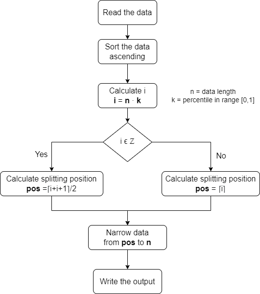

# Data Engineer test - Tinybird
This is the technical test for the data engineer position.
## Introduction
The aim of this project is, given the data from [NYC “Yellow Taxi” Trips Data](https://www1.nyc.gov/site/tlc/about/tlc-trip-record-data.page), return all the trips over 0.9 percentile in distance traveled.

While the development of this project, the website replaced their CSV files to parquet files, so I decided to upload the previous CSV on [Google Drive](https://drive.google.com/file/d/1BrBP2plgKyHNo_Fp8-zvAN5NB5LF-gYl/view?usp=sharing).

## Test
You can test the code using:
```bash
python percentile_calculator.py -f <filepath> -p <percentile>
```
Options: \<filepath\> is the path where the file is located and \<percentile\> is a value between 0 and 1.

**Important**: the CSV has to be comma-delimited and the data used to calculate the percentile must be located at the 4th column.

Example:
```bash
python percentile_calculator.py -f yellow_tripdata_2022-01.csv -p 0.9
```
## Algorithm
First of all, we read the comma-delimited CSV in order to obtain the data.
Once we have the data we sorted it ascending by the distance traveled.

Then, we calculate the position where the data has to be splitted based on the pertencile value **k**. Steps:
- Calculate i as **i = n · k** (where n is the length of the data and k is the percentile value)
- Calculate the splitting position:
  - If i is an integer number: **pos =⌈i+i+1⌉/2** (*)
  - Otherwise: **pos = ⌈i⌉** (*)
- Once we have the splitting position **pos**, we can narrow the data from position **pos** to position **n**.
- Lastly, we print and write the results.
  
(*) The symbol ⌈ ⌉ indicates rounded up.

Here we can see the flow of the algorithm:




## Contact
Raquel Blanco Morago \
raquel.blanco.morago@gmail.com
